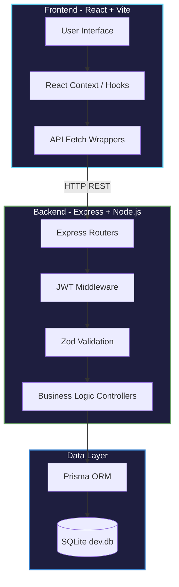
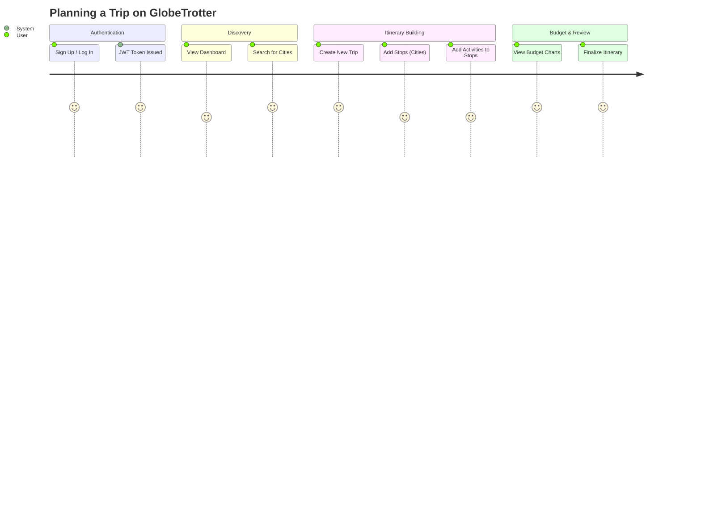
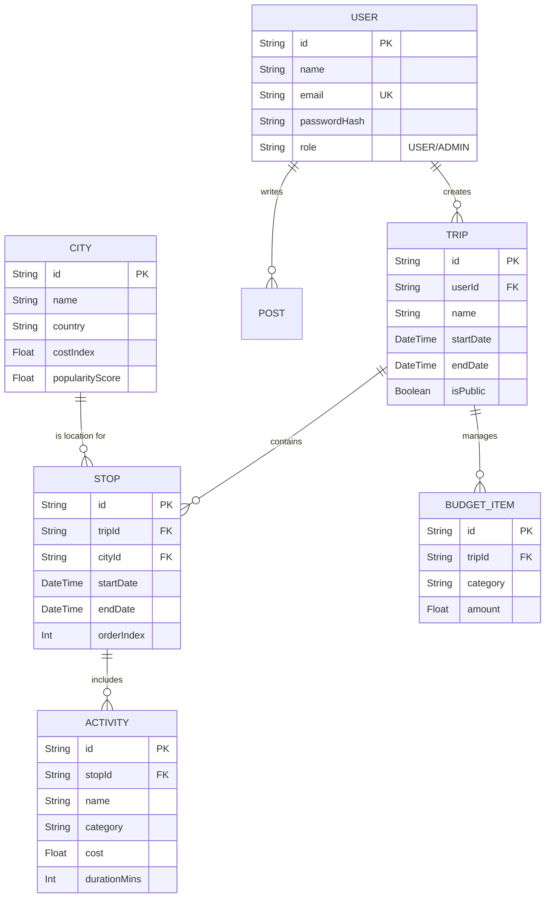

<div align="center">
  

  <h1>🌍 GlobeTrotter</h1>
  
  <p><strong>A sophisticated, intelligent platform for planning, visualizing, and budgeting multi-city trips seamlessly.</strong></p>
  
  <p>
    
    
    
    
    <br/>
    
    
    
  </p>
</div>

---

## 📖 Overview

GlobeTrotter was developed during a 24-hour hackathon to demonstrate a complete, full-stack monorepo application. It transforms the chaotic process of trip planning into a visually stunning, dynamic, and intuitive experience. Users can build itineraries step-by-step, manage daily activities, and automatically calculate categorical budgets based on real-time data.

---

## ✨ Core Features

*   **Dynamic Itinerary Builder:** Create trips with multiple stops. Reorder them chronologically with an intuitive drag-and-drop interface.
*   **Activity Engine:** Add specific activities (Sightseeing, Food, Adventure) to each stop, tied to real-world catalog data.
*   **Automated Budgeting:** Automatically calculates and aggregates costs across all stops. Visualizes expenses via interactive Recharts (Pie and Bar graphs).
*   **Global Discovery:** Search and filter through a seeded database of international cities and curated activities.
*   **Personalized Dashboard:** A customized landing page showcasing upcoming trips and trending destinations.

---

## 🏗️ Architecture & Workflow

GlobeTrotter follows a strict client-server separation within a monorepo structure.

### High-Level Architecture Flowchart



### User Journey Workflow



---

## 🗄️ Database Structure

The application uses Prisma ORM connected to a SQLite database. The schema is highly normalized to handle complex many-to-many travel relationships.

### Entity-Relationship (ER) Diagram



---

## 🚀 Getting Started

Follow these steps to spin up the entire full-stack environment locally.

### Prerequisites
*   Node.js v18+
*   Git

### 1. Clone the Repository
```bash
git clone https://github.com/shivam78775/oddo-hackthon.git
cd oddo-hackthon
```

### 2. Backend Setup
The backend serves the REST API and connects to SQLite.
```bash
cd backend

# Install dependencies
npm install

# Set up environment variables
cp .env.example .env

# Generate SQLite DB and Prisma Client
npx prisma db push

# Seed the database with 30 cities and 50 activities
npm run db:seed

# Start the dev server (Runs on port 4000)
npm run dev
```

### 3. Frontend Setup
Open a **new terminal window** and navigate to the frontend directory.
```bash
cd frontend

# Install dependencies
npm install

# Set up environment variables
cp .env.example .env

# Start the Vite development server (Runs on port 5173)
npm run dev
```

### 4. Experience GlobeTrotter
Navigate to `http://localhost:5173` in your browser. Create an account, build a trip, and watch the budget dynamically generate!

---

<div align="center">
  <p>Built with ❤️ during the Odoo Hackathon.</p>
</div>
