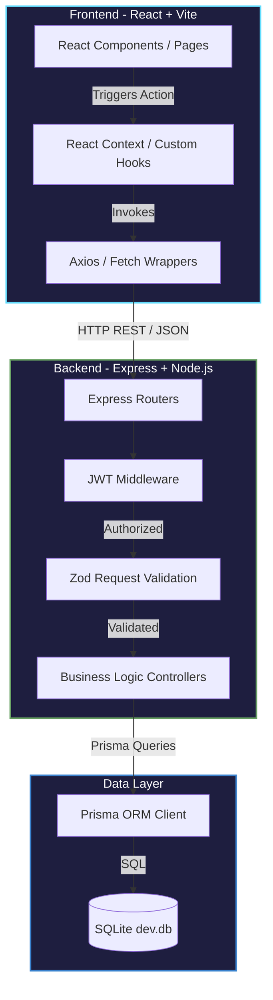
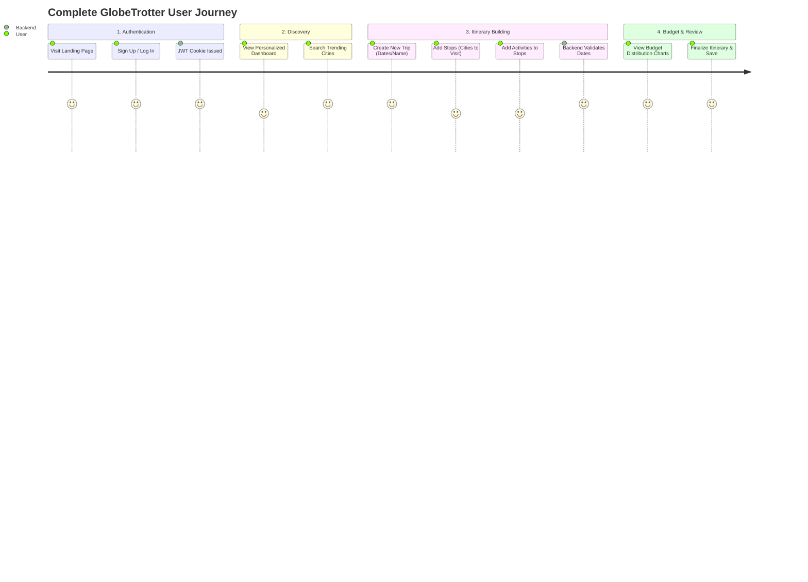
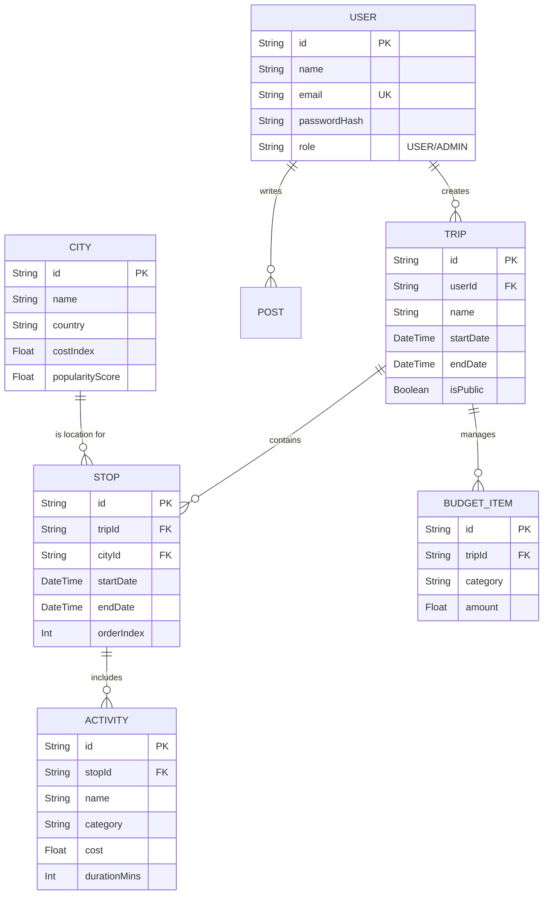

<div align="center">
  <h1>🌍 GlobeTrotter</h1>
  
  <p><strong>A sophisticated, intelligent platform for planning, visualizing, and budgeting multi-city trips seamlessly.</strong></p>
  
  <p>
    
    
    
    
    <br/>
    
    
    
  </p>
</div>

---

## 📖 Overview

GlobeTrotter was developed from the ground up during a 24-hour hackathon to demonstrate a complete, production-ready full-stack monorepo application. It transforms the chaotic process of trip planning into a visually stunning, dynamic, and intuitive experience. Users can build itineraries step-by-step, manage daily activities across multiple cities, and automatically calculate categorical budgets based on real-time backend data.

Unlike standard mock applications, GlobeTrotter utilizes a real Express+Prisma backend connected to a SQLite database. It implements full CRUD operations, JWT-based authentication, and runtime data validation using Zod.

---

## ✨ Features Deep-Dive

### 1. Dynamic Itinerary Builder
- **Multi-City Planning:** Users can add multiple destination "Stops" to a single trip. The app connects to a real database of seeded cities with geographical and popularity metrics.
- **Chronological Sorting:** The itinerary builder dynamically reorders stops chronologically based on user-selected start and end dates.
- **Activity Engine:** Within each stop, users can seamlessly add inline activities (Sightseeing, Food, Adventure, Transport). The backend actively recalculates totals and durations.

### 2. Comprehensive Budget Engine
- **Automated Cost Aggregation:** The backend aggregates the costs of all activities and base expenses (like flights and hotels) across all stops to provide a total estimated trip expense.
- **Categorical Breakdown:** Expenses are grouped by category. The frontend utilizes `recharts` to render a dynamic Pie Chart showing the distribution of costs visually.
- **Budget Tracking:** Dedicated endpoints ensure that the user's allocated budget is compared against actual estimated expenses.

### 3. Global Discovery & Search
- **City Search Engine:** A high-performance search engine to discover cities based on regions. Features debounced searching and backend pagination.
- **Activity Catalog:** Browse a predefined catalog of 50 real-world activities, filterable by category and cost index.

### 4. Interactive & Premium UI/UX
- **Glassmorphism Design:** Custom Tailwind CSS configuration offering a dark-themed, glass-like aesthetic with subtle gradients and drop shadows.
- **Micro-Animations:** Fluid page transitions, hover effects, and loading states provide a premium application feel.
- **Responsive Layout:** fully optimized for mobile devices, tablets, and desktop viewports.

---

## 🏗️ Architecture & Workflow

GlobeTrotter follows a strict client-server separation within a monorepo structure.

### High-Level Architecture Flowchart



### User Journey Workflow



---

## 🗄️ Database Structure

The application uses Prisma ORM connected to a SQLite database. The schema is highly normalized to handle complex many-to-many travel relationships.

### Entity-Relationship (ER) Diagram



---

## 📡 Core API Reference

The backend exposes a comprehensive RESTful API. Below is a high-level overview of the primary routes. All routes (except `/api/auth/login` and `/register`) require a valid JWT cookie.

| Method | Endpoint | Description |
|--------|----------|-------------|
| **POST** | `/api/auth/register` | Registers a new user and returns a JWT |
| **POST** | `/api/auth/login` | Authenticates a user and sets an `httpOnly` cookie |
| **GET**  | `/api/auth/me` | Returns the currently authenticated user profile |
| **GET**  | `/api/trips` | Fetches all trips belonging to the authenticated user |
| **POST** | `/api/trips` | Creates a new trip |
| **GET**  | `/api/trips/:id` | Fetches a specific trip, including all nested stops and activities |
| **GET**  | `/api/cities/search` | Queries the database for cities (supports `?q=` query parameters) |
| **GET**  | `/api/budget/:tripId` | Calculates and returns aggregated categorical budget data for a trip |

---

## 🚀 Getting Started

Follow these steps to spin up the entire full-stack environment locally.

### Prerequisites
*   **Node.js:** v18 or higher
*   **Git:** Version control

### 1. Clone the Repository
```bash
git clone https://github.com/shivam78775/oddo-hackthon.git
cd oddo-hackthon
```

### 2. Backend Setup
The backend serves the REST API, handles authentication, and connects to the SQLite database.
```bash
cd backend

# Install all backend dependencies
npm install

# Set up environment variables
cp .env.example .env

# Generate SQLite DB schema and Prisma Client types
npx prisma db push

# Seed the database with 30 cities and 50 activities for testing
npm run db:seed

# Start the Express development server (Runs on port 4000)
npm run dev
```

### 3. Frontend Setup
Open a **new terminal window** and navigate to the frontend directory.
```bash
cd frontend

# Install all frontend dependencies
npm install

# Set up environment variables
cp .env.example .env

# Start the Vite development server (Runs on port 5173)
npm run dev
```

### 4. Experience GlobeTrotter
1. Open your browser and navigate to `http://localhost:5173`.
2. Click **Sign Up** to create a test account (or use the seeded demo credentials if provided).
3. Experience the full flow: Create a trip, add cities, assign activities, and watch the budget charts render dynamically!

---

<div align="center">
  <p>Built with ❤️ during the Odoo Hackathon.</p>
</div>
